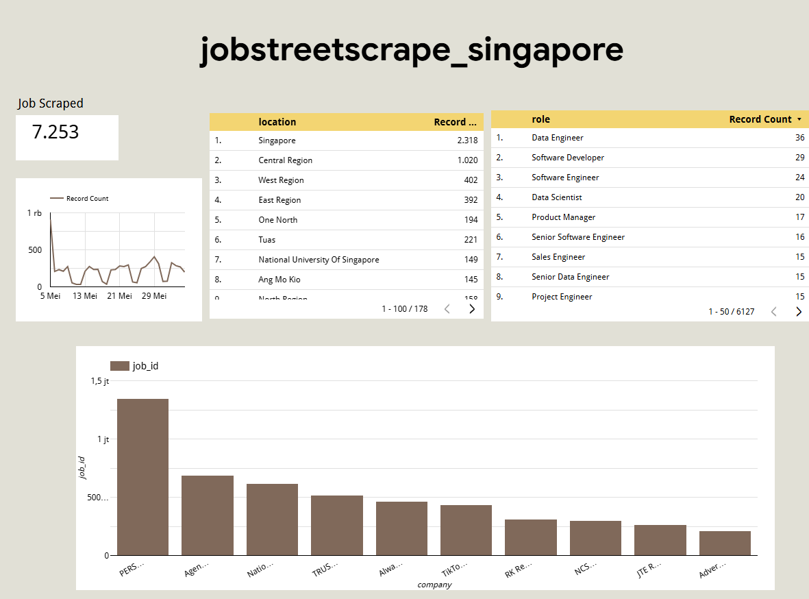
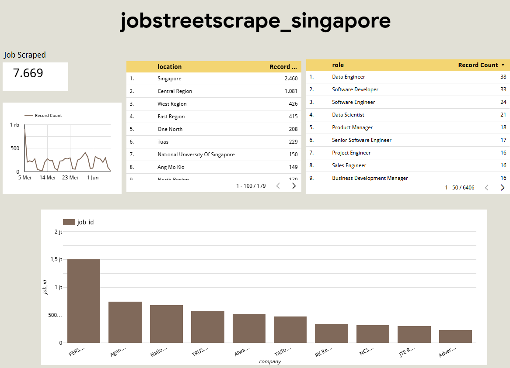
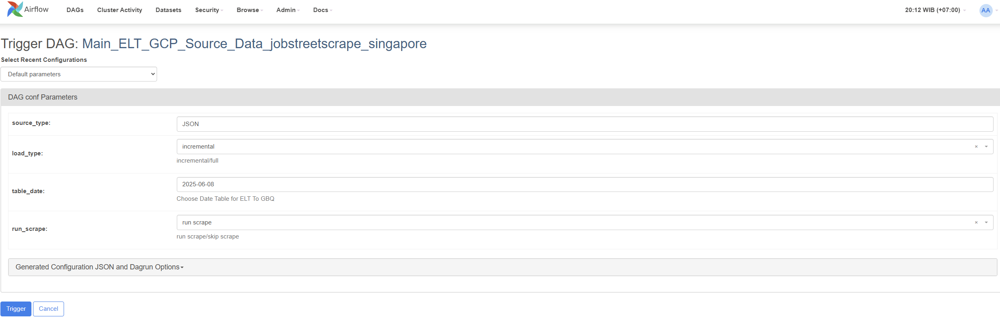
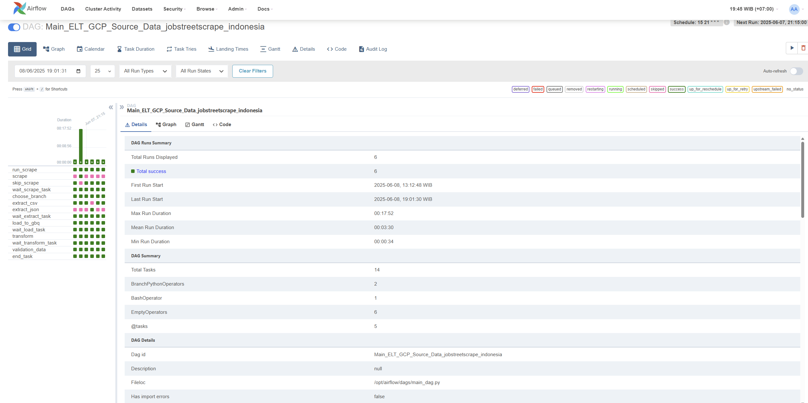
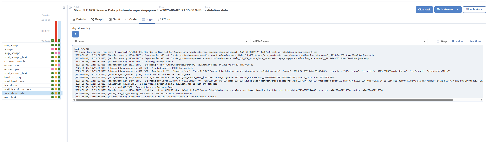
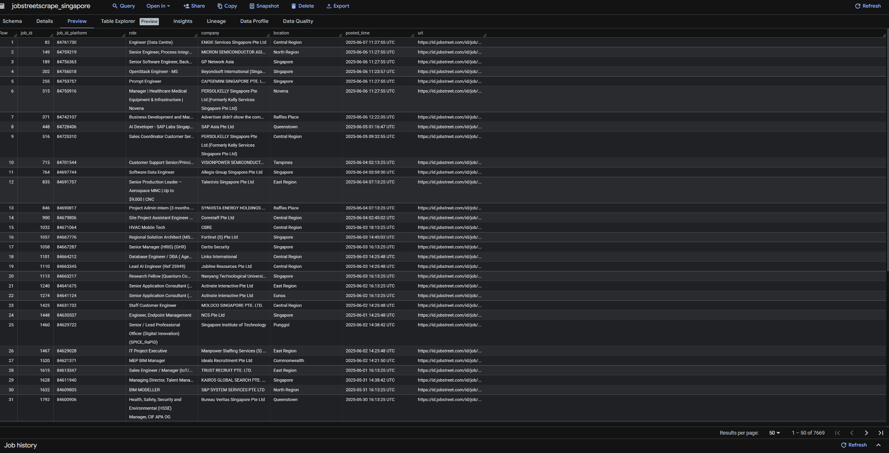

# Dynamic ELT Jobstreet Data using Airflow and GCP 

## 1. Objectives
- Build a modular and scalable ELT pipeline from jobstreet source.
- Automate job data collection from JobStreet with choosen keywords.
- Perform transformations and load data into Google Cloud BigQuery.

This repository includes the following steps:  
## 2. Tech Stacks
- 🐍 Python 3.10
- 🌬️ Apache Airflow (Dockerized)
- 📄 Parquet, Pandas
- 🛢️ Google BigQuery
- 🌐 Selenium for scraping
- 🐳 Docker + Docker Compose

# 3. Architecture Diagram

# 4. Control Flow Graph

## Pipeline Features
- Scraping module using Selenium (JobStreet)
- Branching DAGs for dynamic input format handling
- Incremental data loading logic
- Data validation tasks after loading
- Choose table based on date for ELT.
- Stored intermediate files in local staging as Parquet
# 5. How to Run
```bash
# 1. Clone the repo
git clone https://github.com/msidqyd/elt-jobstreet-gcp-pipeline.git
cd elt-jobstreet-gcp-pipeline

# 2. Start Airflow
docker compose --profile airflow up -d --build

# 3. Start Airflow
# Replace with your credential
Project = 'your_credential'                                             # At Main_DAG
GOOGLE_APPLICATION_CREDENTIALS=/opt/airflow/dags/your_credential.json   # At .ENV

# 4. Access Airflow UI
http://localhost:8080
```
# 6. Example Screenshoot
#### Configurable Parameters
which the user could choose:
- source type CSV/JSON
- load type full/incremental
- table date, which table want to ingest
- also, run the scrape or skip the scrape
below is the example of new day, so run scrape and choose table date same time the data scraped


### Airflow DAG running 



### Records before incremental Load


### Records after incremental Load


### Table before & after incremental



### Scrape Result by Keywords
- Big Data Engineer
- Data Engineer
- Data Platform Engineer
- ETL Developer
- Data Pipeline Developer
- Data Infrastructure Engineer
- Data Integration Engineer
- DataOps Engineer

https://lookerstudio.google.com/reporting/3b4f56b0-1baf-49dc-a967-d5c8abf51880
https://lookerstudio.google.com/reporting/c4302f79-56c6-4a07-b943-4bd44a9d0d71

## Data Validation
- ✅ Row count checks
- ✅ Schema matching
- ✅ Null/missing value reports


## Feel free to explore and adapt this pipeline for your own use cases
